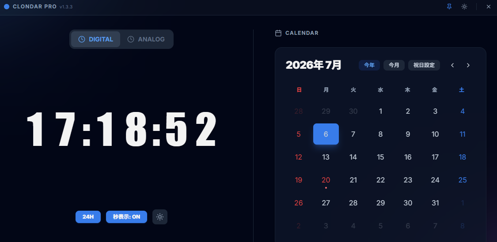

# 🕒 Clondar

**English** | [日本語版](./README.ja.md)

[](https://github.com/tkshnkgwr/clondar/actions)
[](https://github.com/tkshnkgwr/clondar/actions)
[](https://github.com/tkshnkgwr/clondar/releases)
[](https://www.rust-lang.org/)
[](https://nodejs.org/)
[](https://v2.tauri.app/)
[](LICENSE)

<!-- UPDATE 2026-06-21: Translated main README to English and linked to README.ja.md under multi-language structure. -->

**Clondar** is a modern desktop widget-type clock & calendar application that strikes an ultra-minimal look with a transparent, borderless, and shadowless design blending natively into your Windows desktop.

Powered by Tauri v2, it operates with extremely low resource consumption, stays "Always on Top" if desired, and lets you check your schedules and time in a beautiful, streamlined view.



## ✨ Core Features

- **💎 Genuine Borderless Design**: Windows default titlebars, borders, and window drop shadows are completely eliminated.
- **🌑 Transparent Canvas & Glassmorphism**: Preserves your beautiful desktop wallpaper underneath while utilizing soft background-blur filters for peak readability.
- **⏰ Hybrid Clock**:
  - **Digital**: Bold, muscular display based on Impact-inspired typography. Supports 12H/24H formats and show/hide seconds sub-clock.
  - **Analog**: Super-minimal sweep second hand movement.
- **📅 Smart Calendar**:
  - Full support for Japanese national holidays (including substitute and national press holidays).
  - Built-in visual stability with a locked 6-week grid layout.
  - Full-screen "Yearly Calendar" modal (with quick toggling to previous/next years).
- **💾 Robust State Persistence (v1.2.2)**:
  - **Physical Coordinate Restoring (DPI-Aware & Tauri v2 Optimized)**: Prevents coordinates drifting in multi-monitor or high-DPI scaling setups. Fully migrated to Tauri v2's modern `setPosition` API for improved stability.
  - **Startup Race-Condition Guard**: Incorporates an `isRestoringRef` locking gate preventing the window's centering animation from accidentally overwriting clean coordinate saves in LocalStorage.
  - **On-Exit Instant Save**: Automatically captures and records the absolute window position right before the application closes, ensuring 100% position persistence regardless of dragging status.
  - Restores clock visual preferences (seconds visible, 24-hour style), opacity level, and Always on Top toggle automatically upon relaunch.
- **🖱️ Drag-Anywhere Canvas**: Fully interactive drag region mapped across the widget profile page.
- **📌 Stay on Top**: Freeze the widget window over other app views to monitor calendars at a glance.
- **🌓 Dynamic Dark Mode**: Synchronizes beautifully with system styling preferences.

## 🛠️ Tech Stack

- **Backend / Core Engine**: Rust ([Tauri v2](https://v2.tauri.app/))
- **Frontend / Framework**: React 18 (Vite / Local Bundled for complete offline operation) / Tailwind CSS v3
- **Animation**: [Framer Motion](https://www.framer.com/motion/) (CSS Transitions & Animations)
- **Styling**: Modern UI matching Fluent Design guidelines
- **CI/CD & Automation**: GitHub Actions (Release compilation), Dependabot (Cargo & Workflows auto-update)
- **Editor Standards**: EditorConfig, VS Code Workspace settings (.vscode)

---

## 🚀 Getting Started & Local Development

To run or compile this widget locally, you will need **Node.js** and **Rust** installed on your system.

### 1. Clone the Repository & Install Dependencies
```bash
git clone https://github.com/tkshnkgwr/clondar.git
cd clondar

# Install frontend dependencies (Vite)
npm --prefix ui install
```

### 2. Launch Dev server
```bash
# Frontend Vite dev server and Tauri window will start simultaneously
cargo tauri dev
```

### 3. Build Production Installer
```bash
cargo tauri build
```
Once build finishes, you will find compilation assets (.msi or .exe installer) generated under `src-tauri/target/release/bundle/msi/` or `src-tauri/target/release/bundle/nsis/`.

---

## 🎨 Changing Your Application Icons

You can easily customize desktop and system tray icons by following these steps:

### Method A: Automated Asset Slicing (Recommended)
Tauri supports instant icon resizing through a single high-resolution square image source (512x512px or higher is recommended).

1. Place your target image as `source_icon.png` in the project root.
2. Open terminal and run:
```bash
npx tauri icon /path/to/source_icon.png
```
This utility automatically replaces all standard files inside `src-tauri/icons/` (e.g. `icon.ico`, `icon.icns`, and scaling PNG copies) and wires them to `tauri.conf.json`.

### Method B: Manual Replacements
If you prefer manual placement, overwrite the files below with identical file extensions and names:
- **Windows Executable & Taskbar**: Replace `src-tauri/icons/icon.ico`
- **Other OS Tray & Platform UI PNG assets**: Replace scaling assets under `src-tauri/icons/`

After replacing, trigger a `cargo clean` and execute `cargo tauri dev` or `cargo tauri build` to render new icon skins onto your system environment.

---

## 📝 Desktop Widget Design Directives (Tauri v2 Golden Setup)

This widget is specialized for Windows and low-spec environments using specific design parameters:

- **1. Shadow Removal**:
  Binds Rust-side `set_shadow(false)` commands with `tauri.conf.json` properties (`"shadow": false`) to fully eliminate default OS borders/glow margins.
- **2. Scoped Permissions**:
  Strict access keys (`allow-start-dragging`, `allow-close`, `allow-outer-position`, `allow-set-position`) are configured in `capabilities/default.json` to keep system memory footprints lightweight and sandboxed.
- **3. Pointer Events**:
  Configures `html, body { pointer-events: auto; }` so you can click and drag anywhere even on transparent backgrounds.

---

## 🔍 Troubleshooting (FAQ)

### Q. The widget disappeared off-screen (outside the desktop) and I cannot drag it back.
Due to disconnecting multi-monitors or accidental coordinate saving, the widget may spawn off-screen. Follow these steps to reset:
1. Close the application.
2. Under Windows, clear the application's LocalStorage. Typically, you can find local storage cache files under `%LOCALAPPDATA%\com.clondar.pro`. Alternatively, if you have developer tools enabled, run `localStorage.clear();` inside the console, and relaunch the application to force it to reset back to the default center coordinates.

### Q. The background is not transparent, or black/white borders and shadows are visible.
1. Ensure your OS graphics drivers are up to date.
2. The Tauri configuration might need a clean build. Navigate to the `src-tauri` directory, run `cargo clean`, and rerun `cargo tauri dev` or `cargo tauri build`.
3. Check if Windows "Performance Options" -> "Show shadows under windows" is interfering with the borderless configuration.

---

## 🛠️ Advanced Development & Maintenance

### 📅 Updating Japanese National Holidays (Legal Changes)
If Japanese public holidays are amended by legislation, update the holiday definition file:
1. Open [ui/public/config/holidays.json](./ui/public/config/holidays.json).
2. Add or modify holiday dates and rules (fixed holidays, happy mondays, etc.) to match the new legal requirements.
3. Open the "Holidays Manager" modal by clicking the "**Holidays Config**" (or "**祝日設定**") button on the widget to visually verify that modifications are correctly calculated and compared against the built-in defaults.
4. After confirming correct operation, update [TEST_REPORT.md](./TEST_REPORT.md).

### ⚙️ Editor Configurations
This project standardizes editor settings using `.editorconfig` and `.vscode/settings.json`.
* **UTF-8 (without BOM)** & **LF** are enforced for all general code files.
* **UTF-8 with BOM** & **CRLF** are enforced for PowerShell scripts (`*.ps1`) to avoid execution issues in Windows PowerShell 5.1.
* Indentation: 4 spaces for Rust, 2 spaces for others.

### 🤖 CI/CD & Automated Releases
* **Dependabot**: Automatically scans Cargo dependencies and GitHub Actions workflows weekly to submit update Pull Requests.
* **GitHub Actions Release**: When a tag matching `v*` (e.g. `v1.2.3`) is pushed to GitHub, a workflow triggers automatically to build the Windows app installer (`.msi` or `.exe`) and upload it to a draft GitHub Release.

### 📦 Release & Versioning Checklist
Before packaging a new release, verify you have executed the following steps:

1. **Bump Version Codes**:
   * Open PowerShell 7 (`pwsh`) and run:
     ```powershell
     pwsh -File scripts/bump-version.ps1 -NewVersion "1.2.3"
     ```
     This automatically updates versions in `Cargo.toml`, `tauri.conf.json`, `docs/SPECIFICATION.md`, and `docs/TEST_REPORT.md` dynamically.
2. **Rebuild Application Icons (If changed)**:
   * Provide a source image (512x512px+) and run `npx tauri icon /path/to/icon.png`.
   * Make sure to run `cargo clean` to ensure Tauri updates system cache files.
3. **Log Changes**:
   * Append your version notes into [CHANGELOG.md](./CHANGELOG.md).
4. **Trigger Automated Build & Release**:
   * Push a Git tag matching your version (e.g., `git tag v1.2.3` and `git push origin v1.2.3`). GitHub Actions will handle the build and create a draft release.

---

## ⚠️ OS Warnings

- **Windows SmartScreen**: Custom, un-signed installers will warrant a standard diagnostic security screen. Click on "More Info" and select "Run Anyway" during your initial boot.
- **WebView2**: Standard in Windows 10 & 11 base machines. Older environments or stripped operating environments might require installing Microsoft WebView2 Runtime.

## 📄 License

[MIT License](./LICENSE)

---
Developed by [tkshnkgwr](https://github.com/tkshnkgwr)
