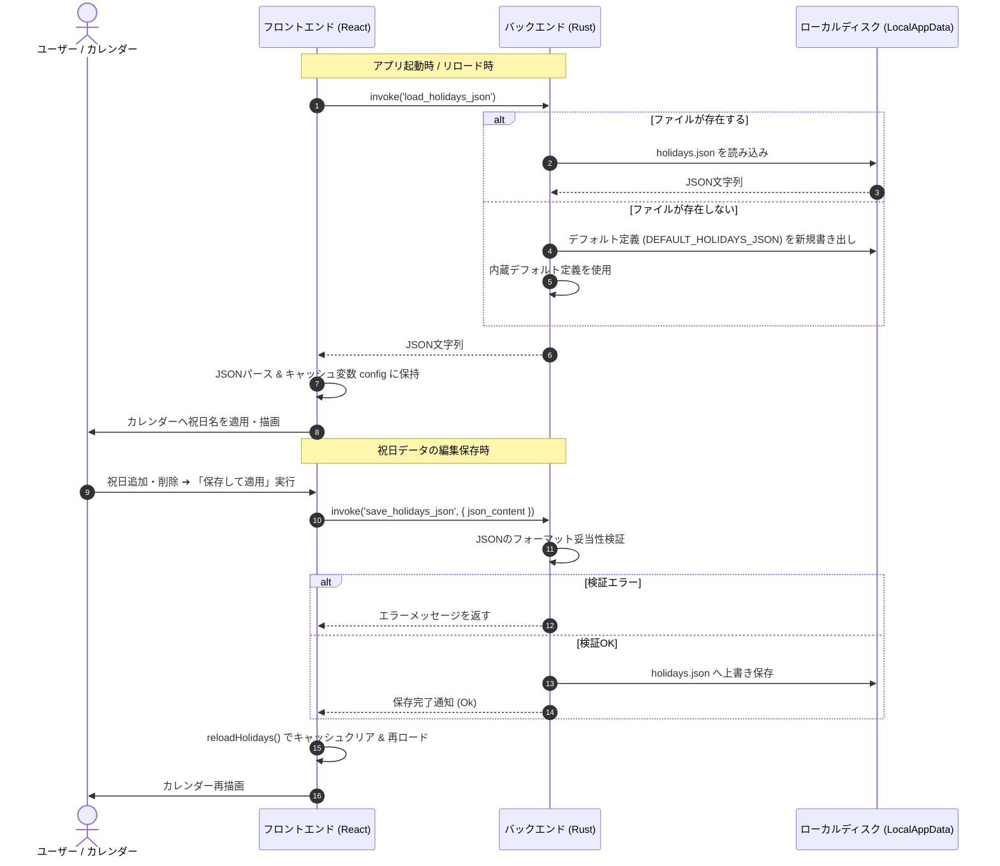
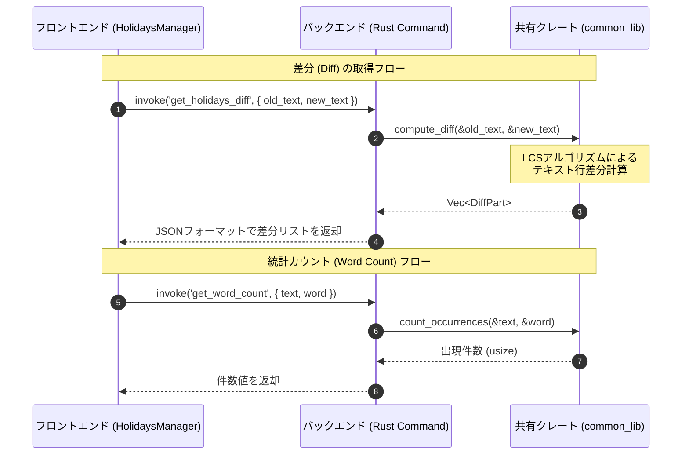
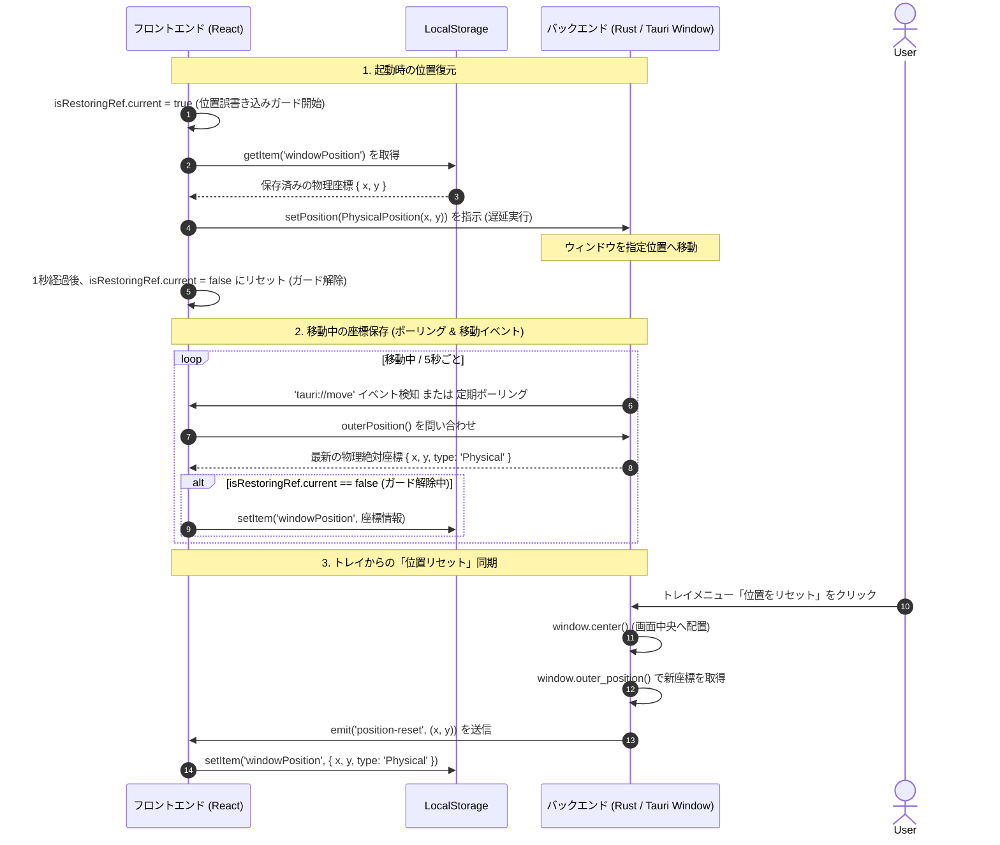

# Clondar Pro アーキテクチャ設計書 (Tauri v2 Edition)

本ドキュメントは, Clondar Pro のシステムアーキテクチャ、プロセス構造、プロセス間通信（IPC）、データの状態管理、および外部ライブラリとの連携について、技術的な詳細を解説する設計書です。

---

## 1. システム概要と目的

**Clondar Pro** は、Windows デスクトップ専用の常駐型「時計＆カレンダーウィジェット」アプリケーションです。
デスクトップの壁紙と一体化して溶け込むような「究極のミニマリズム」を追求したビジュアルデザインと、オフラインでも完全に動作する堅牢な常駐機能を両立することを目的として開発されています。

### 主な目的と価値
- **デスクトップへの同化**: 透過背景、枠線・タイトルの完全排除（ボーダレス）、およびOS標準のウィンドウシャドウの除去により、壁紙上に直接情報が浮き出ているようなUXを提供。
- **実用的な常駐ツール**: 等幅フォントで揺れのないデジタル時計／なめらかなスイープ運針のアナログ時計と、外部JSONファイルによって自由にカスタマイズ可能なカレンダーを統合。
- **システム親和性とロバスト性**: 二重起動防止、マルチモニター・高DPI環境に配慮した物理座標保存、システムトレイ経由でのコントロール、および安全な終了シーケンスの提供。

---

## 2. 採用している技術スタック

本プロジェクトは、安全で高性能なネイティブ機能を提供するバックエンドと、表現力の豊かなWebフロントエンドを融合させた構成を採用しています。

### 2.1 バックエンド (Rust / Tauri)
- **Rust (edition 2021, rust-version 1.96.0)**: 高速かつ安全なシステム言語。ファイルI/O、プロセス制御、およびOSネイティブAPI呼び出しを担当。
- **Tauri v2 (v2.11.3)**: Webビューをネイティブウィンドウでラッピングする軽量フレームワーク。従来のElectronと比較してフットプリントが極めて小さく、メモリ消費量を抑制。
  - `tray-icon` 機能: 常駐のためのシステムトレイメニューをサポート。
- **serde / serde_json**: 高速なJSONシリアライズ・デシリアライズ。祝日設定の読み書きで使用。
- **tauri-plugin-log (v2)**: 開発時および運用時のロギング。
- **common_lib (共有クレート)**: 別プロジェクトと共通のアルゴリズム（LCSベースのテキストDiff計算、出現頻度集計、および名前付きMutexによる二重起動防止）を提供する共有ライブラリ。

### 2.2 フロントエンド (React / SPA)
- **React 18**: UIを宣言的に構築するコンポーネントライブラリ。
- **Vite 5**: 高速な開発サーバーおよびビルドツール。すべての資産をローカルにバンドルし、完全なオフライン稼働（Offline Complete）を保証。
- **Tailwind CSS v3 / PostCSS**: ユーティリティファーストのCSSフレームワーク。グラスモーフィズムやダークモードの柔軟なスタイリングを実現。
- **Framer Motion**: アプリケーション内のUI切り替えやモーダル開閉時の高品位なアニメーション処理。
- **Lucide React**: ミニマルなアイコンセット。

---

## 3. ディレクトリ構造とその意図

プロジェクトはバックエンド（Rust）とフロントエンド（Vite/React）で明確にリポジトリ構造を分割しており、保守性と開発効率を高める設計にしています。

```
clondar/ (プロジェクトルート)
├── .agents/                    # AIアシスタント用の開発ガイドライン
│   └── AGENTS.md               # 開発における「黄金ルール」
├── .github/                    # CI/CD自動化定義（GitHub Actions）
├── docs/                       # 設計書、仕様書、運用ガイドラインなどのドキュメント
│   ├── ARCHITECTURE.md         # アーキテクチャ設計書 (本ファイル)
│   ├── SPECIFICATION.md        # 最終製品仕様書
│   ├── USER_GUIDE.md           # ユーザー操作マニュアル
│   └── DEVELOPMENT.md          # 開発者向けセットアップ・ビルドガイド
├── scripts/                    # バージョン更新等を行うためのPowerShell補助スクリプト
├── src-tauri/                  # Tauriバックエンド（Rust）
│   ├── capabilities/           # Tauri v2用の実行権限定義
│   │   └── default.json        # 許可するウィンドウ操作やコマンドの宣言
│   ├── icons/                  # 各種アプリアイコン
│   ├── src/                    # Rustソースコード
│   │   ├── main.rs             # メインロジック（ウィンドウ制御、トレイ、コマンド登録）
│   │   └── lib.rs              # ライブラリ部（アプリ起動、デバッグログセットアップ）
│   ├── Cargo.toml              # Rustの依存関係およびビルド最適化定義
│   └── tauri.conf.json         # Tauri設定ファイル（透過設定、ビルド設定）
└── ui/                         # フロントエンド（React）
    ├── public/                 # 静的アセット（設定ファイルのフォールバック用JSON等）
    ├── src/                    # フロントエンドソースコード
    │   ├── components/         # UIコンポーネント
    │   │   ├── Clock.jsx       # デジタル・アナログ時計コンポーネント
    │   │   ├── Calendar.jsx    # カレンダー・年間カレンダーコンポーネント
    │   │   └── HolidaysManager.jsx # 祝日データのビジュアル編集・差分・統計コンポーネント
    │   ├── utils/              # ユーティリティロジック
    │   │   ├── holidays.js     # 祝日定義のロード・保存・祝日日付計算アルゴリズム
    │   │   └── tauri.js        # Tauri JS APIの抽象化（座標復元、ウィンドウ制御等）
    │   ├── App.jsx             # メインコンポーネント（状態管理、各種同期イベント管理）
    │   ├── main.jsx            # エントリーポイント
    │   └── index.css           # Tailwind CSSインポートおよび基本スタイル定義
    ├── package.json            # Node.js依存関係およびビルドスクリプト
    ├── tailwind.config.js      # Tailwind CSSの設定ファイル
    └── vite.config.js          # Viteのビルド設定ファイル
```

### 構造設計 of 意図
1. **`src-tauri` と `ui` の分離**: フロントエンド開発とバックエンド開発を完全に独立させ、モックでのブラウザ確認やホットリロードの恩恵を最大化。
2. **`capabilities` によるセキュアな分離**: Tauri v2 のポリシーに従い、フロントエンドから勝手にOSの任意機能へ触れられないようにし、明示的に許可した権限（移動、終了、最前面等）のみを `default.json` で宣言。
3. **`ui/src/utils` への Tauri API 隠蔽**: フロントエンドのビューコード（`Clock.jsx` や `Calendar.jsx`）が直接 Tauri 特有の API に依存するのを防ぎ、`tauri.js` というラッパーを介すことでブラウザでのモック動作やテストが容易になるように設計。

---

## 4. プロセスモデルと実行ライフサイクル

Tauri v2 フレームワークに基づき、セキュリティと安定性の向上のため、**メインプロセス（Rust）**と**レンダラープロセス（Webview / Microsoft Edge WebView2）**が分離された「マルチプロセスモデル」を採用しています。

```mermaid
graph TD
    subgraph Main_Process [メインプロセス (Rust Backend)]
        RustMain[main.rs]
        TrayCtrl[システムトレイ制御]
        HolidaysCmd[祝日管理コマンド]
        ConfigIO[ファイルI/O]
    end

    subgraph Renderer_Process [レンダラープロセス (React Frontend)]
        ReactApp[App.jsx]
        ClockComp[Clock.jsx]
        CalendarComp[Calendar.jsx]
        HolidaysMgr[HolidaysManager.jsx]
        TauriAPI[Tauri JS API]
    end

    RustMain <-->|"IPC (Commands / Events)"| ReactApp
    TrayCtrl -->|"メニューイベント"| RustMain
    HolidaysCmd -->|"データ処理"| ConfigIO
    ReactApp --> TauriAPI
```

### 4.1 メインプロセス (Rust)
- **役割**: OS ネイティブ機能（ウィンドウの枠・影の制御、システムトレイメニュー、ファイルの永続化、ウィンドウ位置調整）の実行、およびアプリケーションライフサイクル管理。

### 4.2 レンダラープロセス (JavaScript/React)
- **役割**: UI の描画、時計アニメーション、カレンダーの組み立て、ユーザー操作のハンドリング。
- **特徴**: OS に内蔵された Webview コンポーネント内で独立して動作し、直接 OS API に触れることはできません。

### 4.3 システムトレイ（常駐化）
- ウィンドウを閉じる操作（❌ボタンや Escキー）が発生した際、ウィンドウを破棄せず「非表示（Hide）」にするフック処理を Rust 側で実装しています。
- アプリケーションの終了は、システムトレイの右クリックメニューの「終了」からのみ実行可能としており、WebView2 終了時の Win32 エラー（Error 1412）を防ぐために、ウィンドウのクローズフローと終了ステ態（`QuittingState`）を安全に同期しています。

### 4.4 二重起動防止機能 (Named Mutex)
- OS 上でのアプリケーションの重複起動を防止するため、メインプロセス起動（`main` 関数の最初期フェーズ）において名前付きミューテックス（Named Mutex）を使用した二重起動判定を行っています。
- 共有ライブラリの `common_lib::check_single_instance("com.clondar.pro.mutex", "Clondar")` を呼び出し、既に別インスタンスが起動中で Mutex の取得が失敗（`AlreadyRunning` エラーが発生する）する場合は、エラー出力を伴って即座にプロセスを終了（`std::process::exit(0)`）します。
- これにより、低スペック制限環境などにおいて、メモリ消費の肥大化やイベントバスのシグナル競合を防ぎ、ウィジェットとしての堅牢性を担保しています。

---

## 5. データフローとプロセス間連携

フロントエンドとバックエンドは、Tauriが提供するIPC（Inter-Process Communication）を介して緊密に連携しています。

### 5.1 祝日データのロードと保存データフロー
外部祝日設定ファイル (`holidays.json`) は、バックエンドがファイルI/Oを担当し、フロントエンドはそれをパースしてカレンダー計算や管理画面に提供します。



### 5.2 差分比較・統計カウントの連携データフロー
祝日設定マネージャーでのビジュアル差分比較および統計データの集計は、共通ライブラリ `common_lib` に定義された高速なRustロジックに委ねられます。



### 5.3 ウィンドウ物理座標の復旧と同期フロー
マルチモニターや高DPI環境で座標ズレを防ぐため、フロントエンドとバックエンドが協調して「物理絶対座標（`Physical`）」を一貫して処理・記録します。



---

## 6. 状態管理とデータの永続化

データの性質、セキュリティ、およびパフォーマンス要求に基づき、永続化の手法をフロントエンドとバックエンドに明確に分離しています。

### 6.1 フロントエンド永続化 (LocalStorage)
- **対象データ**:
  - `is24Hour` (12H / 24H 表示設定)
  - `showSeconds` (秒表示の ON / OFF)
  - `clockType` (デジタル / アナログ時計タイプ)
  - `isDarkMode` (ダークモード ON / OFF)
  - `isTransparent` (背景透過 ON / OFF)
  - `isPinned` (最前面ピン留め状態)
  - `windowPosition` (前回終了時または移動完了時の物理座標 `{ x, y, type: 'Physical' }`)
- **座標保存におけるセキュリティガード設計**:
  起動時の自動中央配置処理やアニメーションによる過渡的な座標値で `windowPosition` が上書き破壊されるのを防止するため、起動後 1 秒間は `isRestoringRef.current = true` とし、`tauri://move` イベントおよびポーリングによる `LocalStorage` 書き込みを完全に遮断します。

### 6.2 バックエンド永続化 (LocalAppData)
- **対象データ**: 外部祝日設定ファイル (`holidays.json`)。
- **保存先パス**: `%LOCALAPPDATA%/com.clondar.pro/holidays.json`
- **設計意図**:
  祝日定義は法改正等の社会的要因によって不定期に変更されるため、アプリケーションバイナリに組み込まず、外部ファイル化しています。万が一ユーザーがこのファイルを直接削除・破損させた場合は、Rustメインプロセスが自動で検出し、プログラム内蔵のデフォルト定義（`DEFAULT_HOLIDAYS_JSON`）から新規ファイルを自動再生成してフォールバックします。

---

## 7. 外部ライブラリおよび共有クレート連携

プロジェクトの保守性とコード共有性を最大化するため、複数のプロダクトで共通利用されるアルゴリズムは独立したクレート `common_lib` として切り出されています。

### 7.1 `common_lib` 依存関係の解決
- **Git 依存関係への集約**:  
  GitHub Actions や Dependabot 解析でリポジトリ外の相対パス参照エラー（`path_dependencies_not_reachable`）が発生するのを防ぐため、`src-tauri/Cargo.toml` における `common_lib` の依存定義は Git リポジトリ（`https://github.com/tkshnkgwr/common_lib`）を指定しています。
- **開発時ローカルパス・オーバーライド**:  
  ローカル開発時に `common_lib` と `clondar` を同時修正・並行デバッグできるよう、`src-tauri/.cargo/config.toml` にてオーバーライドを定義し、ローカルの `../../common_lib` を優先してロードする設計となっています。
  ```toml
  paths = ["../../common_lib"]
  ```
  ※ このファイルは開発環境に依存するため、`.gitignore` によって Git 追跡から除外されています。
