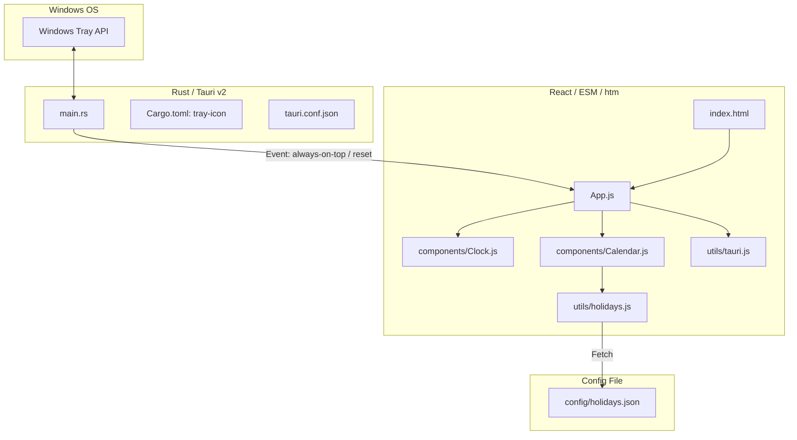

# Clondar Pro 開発者向けドキュメント (Buildless ESM Edition)

本ドキュメントは、Clondar Pro の内部アーキテクチャ、ソースコード分割構成、システムトレイの実装、および外部祝日定義ファイルの構造について、技術的な詳細を解説する開発者用のガイドです。

---

## 1. アーキテクチャの概要

Clondar Pro は、Node.js がインストールされていない環境であっても即座にコンパイル・実行できるよう、**ビルドレス（Buildless）なフロントエンド構成**を採用しています。



### ビルドレス構成の技術的選択
* **ES Modules (ESM)**:
  ブラウザ標準の `import` / `export` を使用してファイルを分割しています。Vite や Webpack 等によるバンドルステップを経ずに、WebView2 が直接ファイルをロードして解析します。
* **`htm` (Hyperscript Tagged Markup)**:
  JSX は通常ビルドステップ（Babel）によるトランスパイルが必要ですが、本プロジェクトでは CDN 経由の `htm` を使用することで、ビルドなしで `html`\`<div>...</div>\`` という JSX 同等の記法を実現しています。
* **CDN 依存**:
  React, Framer Motion, Tailwind CSS, htm は CDN からロードされます。そのため開発および実行にはインターネット環境が必要です。

---

## 2. フロントエンド構成・ファイル分割

フロントエンドは `ui/` ディレクトリの下に配置されており、以下のように役割ごとにモジュール化されています。

```
ui/
├── index.html           # エントリーHTML (CDNライブラリ、ESM main.js のロード)
├── style.css            # グラスモーフィズム等のカスタムCSSユーティリティ
├── config/
│   └── holidays.json    # 外部祝日定義ファイル
└── src/
    ├── main.js          # React のマウント処理
    ├── App.js           # アプリケーション全体のレイアウト、状態管理、イベント購読
    ├── components/
    │   ├── Clock.js     # デジタル・アナログ時計コンポーネント (htm)
    │   └── Calendar.js  # 月間・年間カレンダー、祝日表示、ツールチップ (htm)
    └── utils/
        ├── holidays.js  # holidays.json の読み込みと祝日計算ユーティリティ
        └── tauri.js     # window.__TAURI__ を安全にラップした Tauri v2 API ラッパー
```

### `tauri.js` の設計
Tauri API に直接依存する箇所（ウィンドウ位置復元、ピン留め、終了等）は全て `ui/src/utils/tauri.js` に集約しています。
アプリが通常のブラウザ環境で起動された場合でも、エラーで画面がクラッシュしないよう、Tauri API の存在チェック (`isTauri()`) と安全なフォールバックを実装しています。

---

## 3. システムトレイ（タスクトレイ）常駐機能

ウィジェットの紛失や操作性の向上のため、Tauri v2 規格に準拠したシステムトレイメニューが Rust バックエンド（`main.rs`）で実装されています。

### トレイメニュー項目と動作
1. **表示 / 非表示 (`toggle`)**:
   メインウィンドウの可視状態 (`is_visible`) を判定し、非表示の時は表示・フォーカス、表示中の時は非表示に切り替えます。
2. **最前面表示の切替 (`always_on_top`)**:
   ウィンドウの最前面表示状態を切り替えます。切り替え後、Rust 側からフロントエンドへ `always-on-top-toggled` イベントを `emit` し、フロントエンドのピン留め状態（UI表示）をリアルタイムに同期します。
3. **位置をリセット (`reset_pos`)**:
   ウィンドウを画面中央に移動させます。DPIスケーリングの異なるマルチモニター環境でウィジェットが画面外へ見失われた場合の救済機能です。中央配置後の絶対物理座標を取得し、フロントエンドに `position-reset` イベントを送信することで、次回起動時の記憶座標（`windowPosition`）を即座に更新します。
4. **終了 (`quit`)**:
   アプリケーションを安全に完全終了します。

---

## 4. 外部祝日設定ファイル (`holidays.json`)

日本の祝日計算ロジックを簡素化・外部化するため、`ui/config/holidays.json` に祝日の定義規則が定義されています。

### 設定の構造
* **`fixed`**:
  毎年日付が固定されている祝日（例: `"01-01": "元日"`）。
* **`happy_mondays`**:
  ハッピーマンデー制度に対応する祝日。月・週（何番目の月曜日か）・祝日名・開始年を定義します。
* **`happy_mondays_legacy`**:
  ハッピーマンデーが適用される前の古い祝日制度（例: 1月15日の成人の日）や、移行期の定義。
* **`emperor_birthdays`**:
  歴代の天皇誕生日が適用される開始年と終了年、および日付。
* **`custom_overrides`**:
  2020年や2021年の東京オリンピック等に伴う「特定年限りの祝日移動」を制御するための日付単位の上書き設定。特定の祝日を削除する場合は `null` を指定します。

### 法改正時の対応
将来的に新しい祝日の新設や祝日の移動が行われた場合、ソースコード（JavaScript）を変更する必要はありません。`ui/config/holidays.json` を編集するだけで即座にカレンダーに反映されます。
