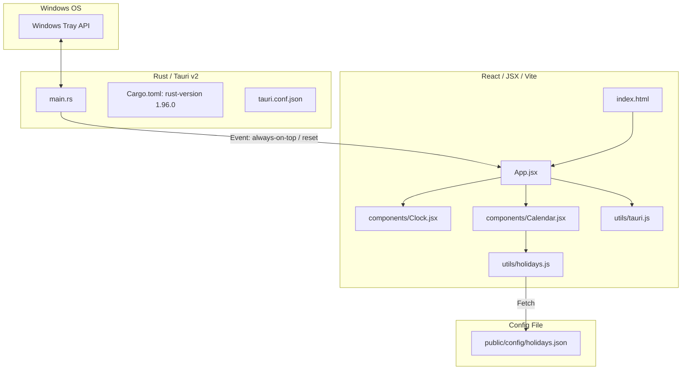

# Clondar Pro 開発者向けドキュメント (Vite React Edition)

本ドキュメントは、Clondar Pro の内部アーキテクチャ、ソースコード構成、システムトレイの実装、および外部祝日定義ファイルの構造について、技術的な詳細を解説する開発者用のガイドです。

---

## 1. アーキテクチャの概要

Clondar Pro は、PC が完全にオフライン状態でも動作するデスクトップウィジェットを実現するため、**Vite + React + Tailwind CSS によるローカルビルド構成**を採用しています。



### 技術スタックの選択
* **Vite / ESM**:
  開発時には高速なホットモジュール置換（HMR）を提供し、ビルド時にはアセットを `ui/dist/` ディレクトリに自己完結型（ローカルバンドル）で書き出します。
* **React & Tailwind CSS (v3)**:
  コンポーネント化されたモダンな UI デザインと、ユーティリティファーストなスタイリングをローカルの `node_modules` に閉じた環境で実現します。これにより、完全にオフラインの状態でも Web 依存せず画面が即座に起動します。
* **Tauri v2 JS API**:
  `@tauri-apps/api` パッケージを介して、安全かつ型定義（TypeScript/JSDoc）に準拠した形で OS 連携（ウィンドウ状態保存、ピン留め、終了など）を呼び出します。

---

## 2. ディレクトリ構成

フロントエンドは `ui/` ディレクトリの下に配置されており、以下のように役割ごとにモジュール化されています。

```
ui/
├── index.html           # エントリーHTML (Viteメイン)
├── vite.config.js       # Vite 設定 (ビルド先: dist)
├── tailwind.config.js   # Tailwind CSS v3 設定
├── postcss.config.js    # CSSプロセッサ設定
├── package.json         # フロントエンド依存関係定義
├── public/
│   └── config/
│       └── holidays.json # 外部祝日定義ファイル (ビルド時に dist/config/ へコピー)
└── src/
    ├── main.jsx         # React のマウントエントリーポイント
    ├── App.jsx          # アプリ全体のレイアウト、状態管理、トレイイベント購読
    ├── index.css        # Tailwind directives + カスタムCSS
    ├── components/
    │   ├── Clock.jsx    # デジタル・アナログ時計コンポーネント
    │   └── Calendar.jsx # 月間・年間カレンダー、祝日表示、ツールチップ
    └── utils/
        ├── holidays.js  # holidays.json の非同期ロードと祝日計算ロジック
        └── tauri.js     # Tauri v2 API の安全なラッパー
```

---

## 3. セットアップと起動方法

本プロジェクトのビルドや開発には **Node.js (v26.4.0 以上推奨)** と **Rust (1.96.0 以上推奨)** が必要です。

また、ビルドの依存関係として共通ライブラリ `common_lib` を使用します。

### 共通ライブラリ `common_lib` の依存解決について
本プロジェクトは、外部共有ライブラリ `common_lib` に依存しています。GitHub Actions や Dependabot でのビルドおよびパッケージ自動更新を正常に通過させるため、リポジトリ内の `src-tauri/Cargo.toml` では以下のように Git リポジトリへの直接参照が設定されています。
```toml
common_lib = { git = "https://github.com/tkshnkgwr/common_lib" }
```

ローカル開発環境で親ディレクトリにある `common_lib` （`../../common_lib`）の変更を即座に適用しながら開発する際は、`src-tauri/.cargo/config.toml` にてローカルパスを優先させるオーバーライド設定を行います。

開発前に、`src-tauri/.cargo/config.toml` を作成して以下の内容を記述してください（このファイルは `.gitignore` に追加されており、Git管理対象外となっています）。
```toml
paths = ["../../common_lib"]
```


### 1. 依存関係のインストール
プロジェクトのルートディレクトリで以下を実行します。
```bash
# フロントエンドの依存関係をインストール
npm --prefix ui install
```

### 2. 開発モードでの起動
`tauri.conf.json` にて、起動時に自動で Vite 開発サーバーが走るよう設定されています。
```bash
cargo tauri dev
```
ファイル変更を検知すると、Rust 側・フロントエンド側ともに自動的にホットリロードが実行されます。

### 3. リリースビルド
```bash
cargo tauri build
```
Vite によるビルドが走り、`ui/dist` に静的ファイルがバンドルされた後、MSI / EXE インストーラーが自動生成されます。

---

## 4. 技術的ハイライト

### ① システムトレイ（タスクトレイ）常駐機能
Rust 側 [main.rs](file:///c:/Users/632792/Documents/自作/clondar/src-tauri/src/main.rs) で `TrayIconBuilder` を使用しトレイアイコンを構築。
右クリックメニューから「表示/非表示」「最前面表示の切替」「位置をリセット」「終了」が操作できます。
最前面トグルや位置リセットは、Tauri のイベントバス (`always-on-top-toggled`, `position-reset`) を通じてフロントエンドの表示と即時連動します。

### ② 外部祝日設定ファイル (`holidays.json`)
日本の祝日計算ルールを `ui/public/config/holidays.json` に集約。
[holidays.js](file:///c:/Users/632792/Documents/自作/clondar/ui/src/utils/holidays.js) がアプリ起動時に非同期でフェッチし、固定祝日、ハッピーマンデー、天皇誕生日、オリンピック特例などの例外上書きを適用します。法改正時は JSON を更新するだけで、JavaScript のコードに手を加えることなくカレンダー表示を更新できます。
