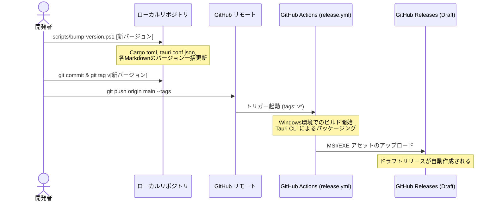

# Clondar Pro リリース手順書 (GitHub Actions Automation)

本ドキュメントは、Clondar Pro のバージョン更新方法、リリースビルドの実行手順、および GitHub Actions による自動リリースフローについて解説するガイドラインです。

---

## 1. リリースフローの概要

Clondar Pro のリリースは、ローカル環境でのバージョンバンプと Git バージョンタグ（`v*`）のプッシュをトリガーとした **GitHub Actions による自動ビルド・デプロイ構成**となっています。



---

## 2. ローカルでのリリース準備

リリースを行う前に、プロジェクト内のすべてのバージョン表記（`Cargo.toml`、`tauri.conf.json`、各種Markdownドキュメント）を統一して更新する必要があります。この作業を自動化するために PowerShell スクリプトが用意されています。

### 2.1 バージョン一括更新スクリプトの実行

PowerShell を起動し、リポジトリのルートディレクトリで以下のスクリプトを実行します。

```powershell
# 実行ポリシーを一時的に緩和してスクリプトを実行 (例: バージョン 1.3.1 へ更新する場合)
powershell -ExecutionPolicy Bypass -File .\scripts\bump-version.ps1 1.3.1
```

- **スクリプトの動作**:
  - `src-tauri/Cargo.toml` の `version = "..."` を更新。
  - `src-tauri/tauri.conf.json` の `version` （および Windows 用内部バージョン表記）を更新。
  - `docs/TEST_REPORT.md` 内の適合バージョン表記を更新。
  - バージョン変更を Git ステージング領域に追加（`git add`）。

---

## 3. バージョンタグの作成とプッシュ

バージョンの更新スクリプトの実行が完了したら、コミットを行い、リリース対象のバージョンタグを作成して GitHub にプッシュします。

```bash
# 1. 変更内容をコミット
git commit -m "chore: release version 1.3.1"

# 2. バージョンタグを作成 (セマンティックバージョニングに準拠し、頭に v を付けます)
git tag v1.3.1

# 3. コミットと作成したタグをリモートにプッシュ
git push origin main
git push origin v1.3.1
```

---

## 4. GitHub Actions での自動ビルドとドラフトリリース

タグのプッシュを GitHub が検知すると、`.github/workflows/release.yml` が自動的に起動します。

### 4.1 ワークフローの実行内容
1. **環境セットアップ**: Node.js および Rust (MSVC ターゲット) 環境をランナー上に構築します。
2. **Git認証構成**: `x-access-token` を用いて、非公開共有ライブラリ `common_lib` への Git 依存フェッチが認証エラーにならないように一時設定します。
3. **フロントエンドビルド**: `ui/` ディレクトリ配下で `npm ci` を実行し、Vite によるアセットコンパイルを実行します。
4. **Tauri アプリのビルド**: `tauri build` を実行し、Windows 向けの最終アセットをコンパイル・パッケージングします。
5. **リリース作成とアップロード**: `softprops/action-gh-release@v2` を用いて、GitHub 上にドラフト（下書き）状態のリリースを作成し、ビルドされたアセットファイルを添付します。

### 4.2 生成されるリリースアセット
ビルド成功時、以下のパスに出力されたアセットが GitHub Releases にアップロードされます。
- `clondar/src-tauri/target/release/bundle/nsis/*.exe` （NSIS サイレントインストーラー）
- `clondar/src-tauri/target/release/bundle/wix/*.msi` （WiX インストーラーパッケージ）

---

## 5. リリースの公開

1. リポジトリの GitHub ページを開き、「**Releases**」にアクセスします。
2. `v1.3.1` のドラフトリリース（Draft）が生成されていることを確認します。
3. リリースノート（CHANGELOG からの抜粋など）を編集し、「**Publish release**」ボタンを押して一般公開します。
