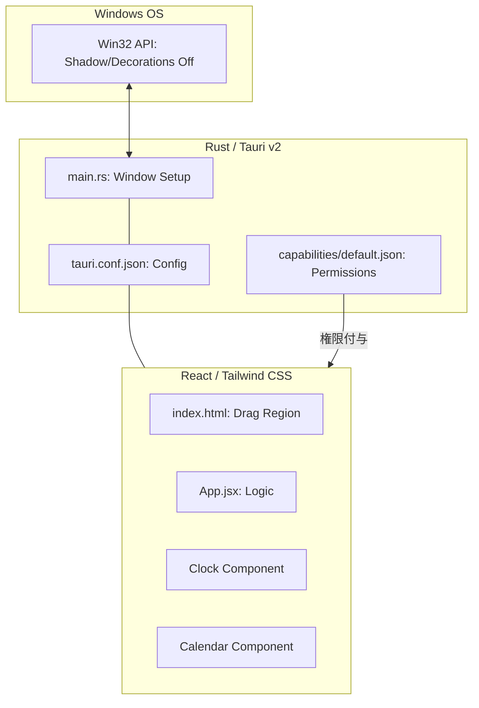

# Clondar Pro 最終製品仕様書 (Tauri v2 Edition)

## 1. 製品概要
**Clondar Pro** は、Tauri v2 を基盤とした Windows デスクトップ専用のウィジェット型時計＆カレンダーアプリケーションです。
「デスクトップに溶け込む」ことをコンセプトに、透過背景、枠なし（Borderless）、影なし（Shadowless）のデザインを極限まで追求しています。

## 2. システム構成図 (Mermaid)

### 2.1 アーキテクチャ構成

## 3. 主要機能詳細

### 3.1 ウィジェット動作 (Desktop Widget)
- **透過ウィンドウ**: 背景を完全に透過させ、デスクトップ壁紙の上に直接表示。
- **枠なし・影なし**: Windows 標準のタイトルバー、枠線、影をすべて物理的に除去。
- **常時最前面 (Always on Top)**: 他のウィンドウに隠れることなく、常に情報を確認可能。
- **ドラッグ移動**: ウィンドウのほぼ全域をドラッグ可能領域 (`data-tauri-drag-region`) とし、自由な配置が可能。
- **終了操作**: `Esc` キーまたは UI 内の `❌` ボタンによる即座な終了。

### 3.2 時計機能 (Clock Section)
- **デジタル時計**:
    - **フォント**: `Impact` 風の力強いサンセリフ体を採用。
    - **安定性**: 等幅フォント設定により、秒の更新による数字の揺れを防止。
    - **表示形式**: 12H/24H 切り替え、秒表示の ON/OFF が可能。
- **アナログ時計**:
    - スムーズなスイープ運針アニメーション。
    - ダークモードに最適化されたミニマルデザイン。

### 3.3 カレンダー機能 (Calendar Section)
- **表示安定性**: 月の長さに関わらず、常に **6週間 (42日間)** を固定表示。
- **日本祝日**: 振替休日、ハッピーマンデー、国民の休日を計算するロジックを内蔵。
- **年間表示**: 全画面の年間カレンダーモーダルを搭載（前年・翌年のナビゲーションに対応）。

### 3.4 永続化機能 (State Persistence)
- **設定の保存**: 以下の設定を `localStorage` に保存し、次回起動時に復元。
    - 12H/24H 表示設定
    - 秒表示の ON/OFF
    - 時計タイプ（デジタル/アナログ）
    - ダークモード設定
    - 背景透過状態
    - 最前面表示（ピン留め）状態
- **ウィンドウ位置の復元 (ロバスト設計)**:
    - 終了時のウィンドウの物理絶対座標 (`PhysicalPosition`) を記憶し、次回起動時にその位置へ自動的に移動（Tauri v2 規格の `setPosition` API を使用）。
    - **位置検出ガード**: 起動直前の配置や位置復元中の過渡的移動によって発生する位置の誤上書きを完全に防ぐ、状態ロード・セキュリティロック設計（`isRestoringRef` による書き込み制限）を搭載。
    - **終了時の即時保存**: ドラッグ中のイベント（`tauri://move`）検知や定期的なポーリングに加え、アプリ終了時（終了ボタンやEscキー押下）に現在の位置を明示的に取得し `localStorage` に書き込むことで、保存の確実性を100%に担保。

## 4. デザイン・UI/UX 仕様

### 4.1 ビジュアルデザイン
- **グラスモーフィズム**: 背景ぼかし（Blur）を適用し、透過しつつも視認性を確保。
- **ボーダレス**: 物理的な枠線を排除し、ピン留め時のみ青いリング（Ring）で状態を表現。
- **タイポグラフィ**: `Inter` (UI) と `JetBrains Mono` (数値) の組み合わせ。

### 4.2 インタラクション
- **コンテキストメニュー禁止**: 右クリックメニューを無効化し、ウィジェットとしての純粋性を維持。
- **ホバーエフェクト**: 祝日名などの情報をツールチップで表示。

## 5. 技術スタック
- **Backend**: Rust (Tauri v2)
- **Frontend**: React 18 (CDN), Tailwind CSS
- **Animation**: Framer Motion
- **Permissions**: Tauri v2 Capabilities System
- **CI/CD / Dependency Auto-update**: GitHub Actions (Automatic Release Build), Dependabot (Weekly checks for Cargo & GitHub Actions)
- **Development Standards**: EditorConfig, VS Code Workspace settings (Encoding and indentation normalization)

## 6. 特筆すべき実装
1. **Shadow Removal**: Rust 側の `set_shadow(false)` と Config 側の `shadow: false` の二重設定により、透過時の「薄い枠」を完全に除去。
2. **Permission Scoping**: `capabilities/default.json` にて、ドラッグ、終了の他、絶対的な位置情報の取得・設定権限（`allow-outer-position`, `allow-set-position`）を明示的に付与。
3. **Pointer Events**: `html, body` に `pointer-events: auto` を設定し、透明部分でのドラッグ操作を安定化。
4. **Startup Position Race-Condition Guard**: 起動時の自動センター寄せ（`center: true`）完了と JS による位置復旧動作 of タイムラグ中に、一時的な位置データを拾って LocalStorage を誤破壊するのを防ぐ `isRestoring` ガードの実装。これにより低スペック PC でも起動位置が極めて安定。
5. **DPI-Aware Coordinate Restoration**: 座標復帰時に `type: pos.type || 'Physical'`（物理ピクセル座標）を保持・適用することで、DPIスケーリングの異なるマルチモニター環境へのポータビリティを確保。
6. **Tauri v2 API Compatibility**: Tauri v2 のグローバル API の構成（`window.__TAURI__.webviewWindow.getCurrentWebviewWindow`）に準拠させ、位置復元時のAPIを廃止された `setOuterPosition` から `setPosition` に最適化。
7. **CI/CD & Editor Settings Automation**: `.editorconfig` と `.vscode/settings.json` の導入による開発環境の一貫性保証。および GitHub Actions 経由での Windows ビルド（MSVCツールチェーン）の自動パッケージングとリリースドラフトの作成。
8. **Automated Dependency Maintenance**: Dependabot を適用し、バックエンド (Cargo) と CI ワークフローのセキュリティ更新およびメジャー/マイナーアップデートを自動で検知・Pull Request 化。

---
**最終更新日**: 2026年6月26日
**バージョン**: 1.2.3
**内部バージョン**: 1.2.3.0
