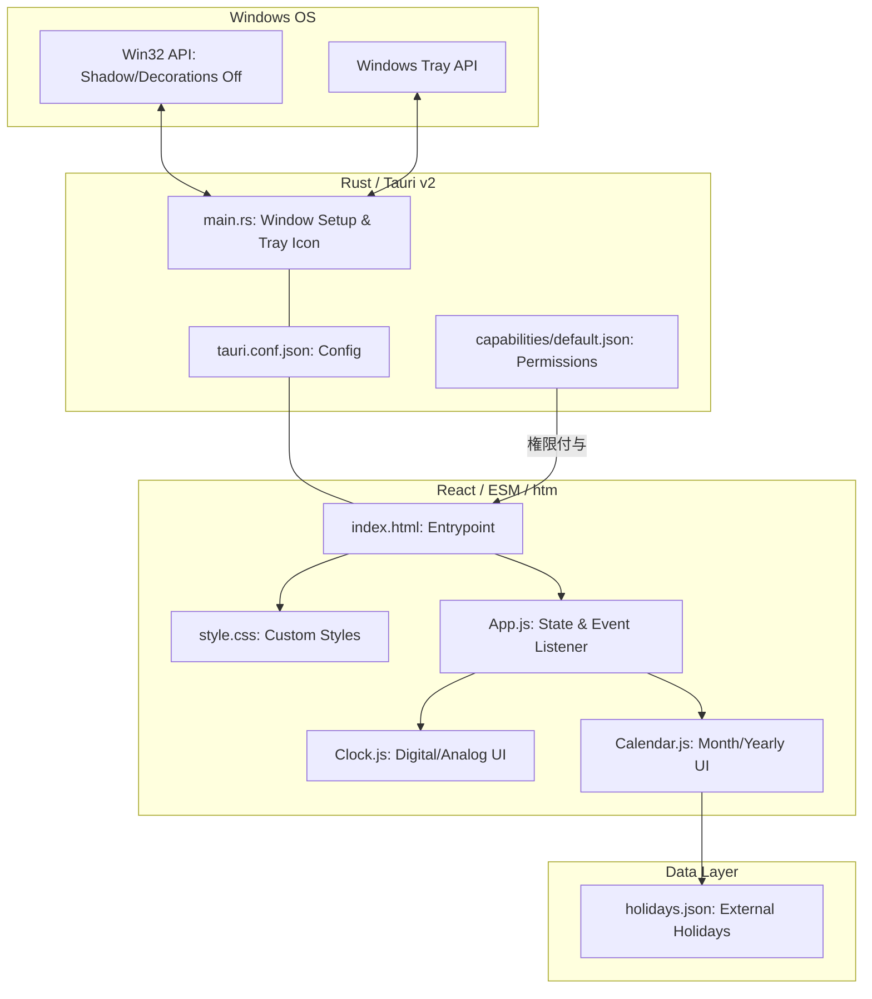

# Clondar Pro 最終製品仕様書 (Tauri v2 Edition)

## 1. 製品概要
**Clondar Pro** は、Tauri v2 を基盤とした Windows デスクトップ専用のウィジェット型時計＆カレンダーアプリケーションです。
「デスクトップに溶け込む」ことをコンセプトに、透過背景、枠なし（Borderless）、影なし（Shadowless）のデザインを極限まで追求しています。

---

## 2. システム構成図 (Mermaid)

### 2.1 アーキテクチャ構成

---

## 3. 主要機能詳細

### 3.1 ウィジェット動作 (Desktop Widget)
* **透過ウィンドウ**: 背景を完全に透過させ、デスクトップ壁紙の上に直接表示。
* **枠なし・影なし**: Windows 標準のタイトルバー、枠線、影をすべて物理的に除去。
* **常時最前面 (Always on Top)**: 他のウィンドウに隠れることなく、常に情報を確認可能。
* **ドラッグ移動**: ウィンドウのほぼ全域をドラッグ可能領域 (`data-tauri-drag-region`) とし、自由な配置が可能。
* **終了操作**: `Esc` キーまたは UI 内の `❌` ボタンによる即座な終了。
* **システムトレイ（タスクトレイ）メニュー**:
  - ウィンドウ非表示時や画面外紛失時でもコントロール可能なように、システムトレイへ常駐。
  - 右クリックメニューより「表示/非表示」、「最前面表示の切替」、「位置をリセット（画面中央へ）」、「終了」の操作が可能。

### 3.2 時計機能 (Clock Section)
* **デジタル時計**:
  - **フォント**: `Impact` 風の力強いサンセリフ体を採用。
  - **安定性**: 等幅フォント設定により、秒の更新による数字の揺れを防止。
  - **表示形式**: 12H/24H 切り替え、秒表示の ON/OFF が可能。
* **アナログ時計**:
  - スムーズなスイープ運針アニメーション。
  - ダークモードに最適化されたミニマルデザイン。

### 3.3 カレンダー機能 (Calendar Section)
* **表示安定性**: 月の長さに関わらず、常に **6週間 (42日間)** を固定表示。
* **外部祝日設定のロード**:
  - `ui/config/holidays.json` より祝日の定義ルールをロード。
  - 固定祝日、ハッピーマンデー、天皇誕生日、天文計算（春分・秋分）、カスタム上書き（オリンピック特例等）を自動計算し、カレンダー上に反映。
  - 法改正時は設定ファイルの編集のみで対応可能。
* **年間表示**: 全画面の年間カレンダーモーダルを搭載（前年・翌年のナビゲーションに対応）。

### 3.4 永続化機能 (State Persistence)
* **設定の保存**: 以下の設定を `localStorage` に保存し、次回起動時に復元。
  - 12H/24H 表示設定
  - 秒表示の ON/OFF
  - 時計タイプ（デジタル/アナログ）
  - ダークモード設定
  - 背景透過状態
  - 最前面表示（ピン留め）状態
* **ウィンドウ位置の復元 (ロバスト設計)**:
  - 終了時のウィンドウの物理絶対座標 (`PhysicalPosition`) を記憶し、次回起動時にその位置へ自動的に移動（Tauri v2 規格の `setPosition` API を使用）。
  - **位置検出ガード**: 起動直前の配置や位置復元中の過渡的移動によって発生する位置の誤上書きを完全に防ぐ、状態ロード・セキュリティロック設計（`isRestoringRef` による書き込み制限）を搭載。
  - **トレイリセット連携**: システムトレイから位置をリセットした際にも、即座に `localStorage` の記憶座標を更新。

---

## 4. デザイン・UI/UX 仕様

### 4.1 ビジュアルデザイン
* **グラスモーフィズム**: 背景ぼかし（Blur）を適用し、透過しつつも視認性を確保。
* **ボーダレス**: 物理的な枠線を排除し、ピン留め時のみ青いリング（Ring）で状態を表現。
* **タイポグラフィ**: `Inter` (UI) と `JetBrains Mono` (数値) の組み合わせ。

### 4.2 インタラクション
* **コンテキストメニュー禁止**: 右クリックメニューを無効化し、ウィジェットとしての純粋性を維持（システムトレイは独自のメニューを表示）。
* **ホバーエフェクト**: 祝日名などの情報をツールチップで表示。

---

## 5. 技術スタック
* **Backend**: Rust (Tauri v2)
* **Frontend**: React 18 (CDN), Tailwind CSS (CDN), htm (CDN)
* **Architecture**: Buildless ES Modules (ESM)
* **Animation**: Framer Motion
* **Permissions**: Tauri v2 Capabilities System
* **CI/CD**: GitHub Actions (Automatic Release Build), Dependabot (Weekly updates)

---

## 6. 特筆すべき実装
1. **Buildless Module Division**:
   Node.js (npm) 未導入環境でも動作するように、Vite等のバンドラを用いず、ブラウザの ES Modules 標準機能と `htm` ライブラリを使用してコードを機能ごとにクリーンに分割。
2. **System Tray Integration**:
   Rust 側のトレイメニューとフロントエンド React を Tauri のイベントバス (`emit` / `listen`) で接続し、最前面ピン留め状態や位置リセット座標の双方向同期を達成。
3. **Shadow Removal**: Rust 側の `set_shadow(false)` と Config 側の `shadow: false` の二重設定により、透過時の「薄い枠」を完全に除去。
4. **DPI-Aware Coordinate Restoration**: 座標復帰時に `type: pos.type || 'Physical'`（物理ピクセル座標）を保持・適用することで、DPIスケーリングの異なるマルチモニター環境へのポータビリティを確保。

---
**最終更新日**: 2026年6月26日
**バージョン**: 1.3.0
**内部バージョン**: 1.3.0.0
