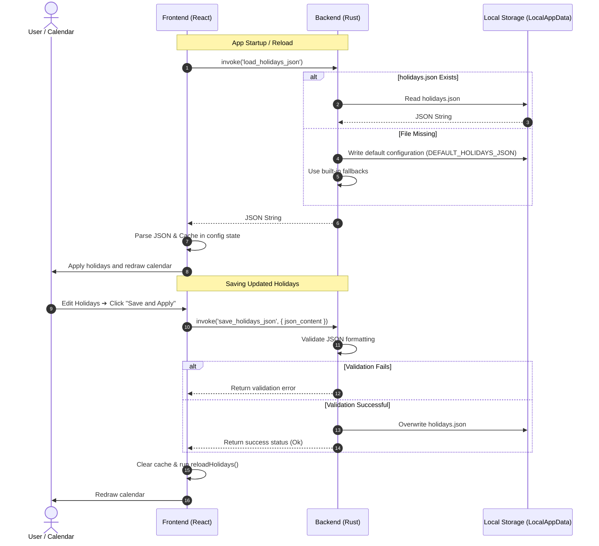
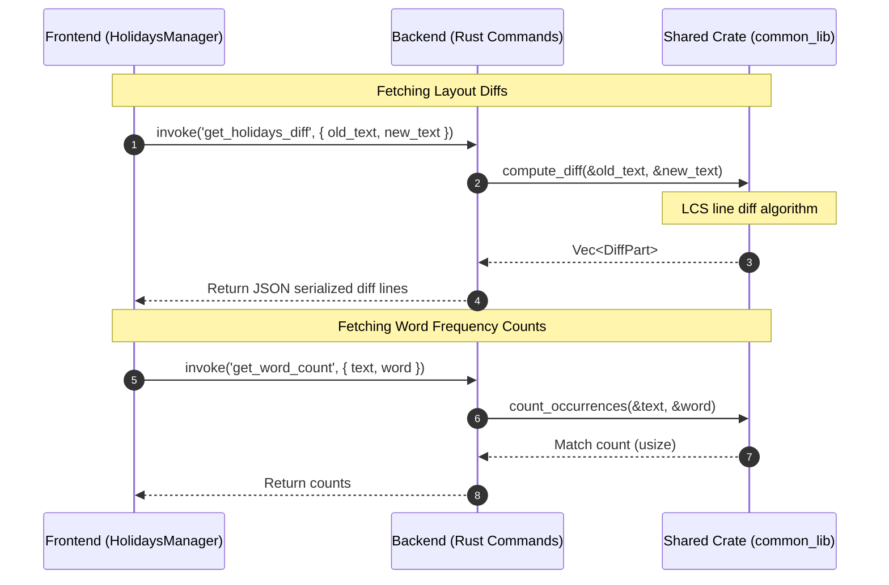
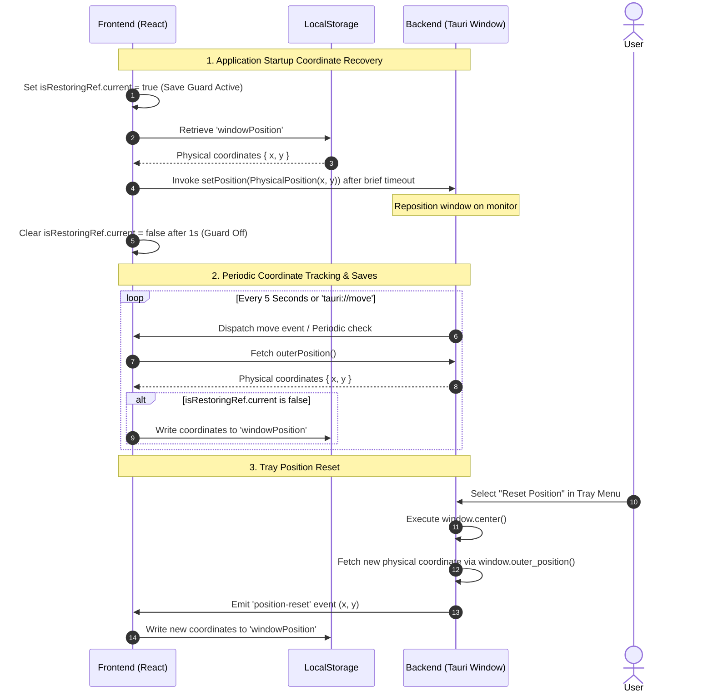

# Clondar Pro Architecture Design Document (Tauri v2 Edition)

**English** | [日本語版](../ja/ARCHITECTURE.md)

This document provides technical details on the system architecture, process model, Inter-Process Communication (IPC), state management, and shared library integrations of Clondar Pro.

---

## 1. System Overview & Objectives

**Clondar Pro** is a resident "clock & calendar widget" application designed exclusively for Windows desktops.
It is engineered to blend "ultimate minimalism" (achieved through borderless, shadowless transparency that integrates natively into the desktop wallpaper) with robust offline functionality.

### Key Objectives & Value Proposition
- **Wallpaper Integration**: Delivers a borderless visual experience by eliminating OS-native window decorations, borders, and drop shadows, rendering information directly onto the desktop surface.
- **Resident Productivity Tool**: Integrates a visually stable digital clock (using monospace fonts), a smooth analog sweeper clock, and a calendar customizable via an external JSON file.
- **Platform Affinity & Robustness**: Ensures reliable execution with single-instance locks, physical coordinate preservation under multi-monitor/high-DPI scaling configurations, system tray operation, and safe termination sequences.

---

## 2. Technology Stack

This application pairs a secure, high-performance Rust backend with a rich React frontend.

### 2.1 Backend (Rust / Tauri)
- **Rust (Edition 2021, rust-version 1.96.0)**: Safe, concurrent system programming language responsible for file I/O, process management, and OS-native API calls.
- **Tauri v2 (v2.11.3)**: A lightweight, low-footprint application framework hosting the Webview window. Consumes significantly less memory compared to traditional Electron wrappers.
  - `tray-icon` plugin: Handles system tray configuration and menu events.
- **serde / serde_json**: Fast JSON serialization and deserialization for reading/writing configuration files.
- **tauri-plugin-log (v2)**: System logger during development and production runtimes.
- **common_lib (Shared Crate)**: Shared utility library providing text diff (LCS), occurrence counts, and single-instance locks (Named Mutex).

### 2.2 Frontend (React / SPA)
- **React 18**: UI component library built declaratively.
- **Vite 5**: Asset bundler ensuring all assets are loaded locally, guaranteeing complete offline capability.
- **Tailwind CSS v3 / PostCSS**: Utility-first styling framework supporting dark modes and glassmorphic designs.
- **Framer Motion**: Smooth animations for view transitions and modal overlays.
- **Lucide React**: Monospaced iconography.

---

## 3. Directory Structure & Layout

The project separates the Rust backend from the React frontend to maximize modularity and development speed.

```
clondar/ (Project Root)
├── .agents/                    # AI developer guidelines
│   └── AGENTS.md               # Coding "Golden Rules"
├── .github/                    # CI/CD automated configurations (GitHub Actions)
├── docs/                       # Specifications, designs, and developer guidelines
│   ├── ja/                     # Japanese Documentation
│   │   ├── ARCHITECTURE.md     # Architecture Document (Japanese)
│   │   ├── SPECIFICATION.md    # Product Specifications
│   │   ├── USER_GUIDE.md       # User Guide
│   │   └── DEVELOPMENT.md      # Developer Setup & Build Guide
│   └── en/                     # English Documentation
│       ├── ARCHITECTURE.md     # Architecture Document (This File)
│       ├── SPECIFICATION.md    # Product Specifications
│       ├── USER_GUIDE.md       # User Guide
│       └── DEVELOPMENT.md      # Developer Setup & Build Guide
├── scripts/                    # PowerShell scripts for automated tasks (e.g., version bumping)
├── src-tauri/                  # Tauri Backend (Rust)
│   ├── capabilities/           # Security capability matrices
│   │   └── default.json        # Declared window controls and IPC command whitelist
│   ├── icons/                  # Application icons across resolutions
│   ├── src/                    # Rust backend source code
│   │   ├── main.rs             # Main process setup (Window, Tray, and command registry)
│   │   └── lib.rs              # Library definitions (Lifecycle events and logger config)
│   ├── Cargo.toml              # Rust crate dependencies and release profiles
│   └── tauri.conf.json         # Tauri compiler configs (Transparency, windows, and bundler)
└── ui/                         # React Frontend (Vite)
    ├── public/                 # Static assets (Default fallback JSON configurations)
    ├── src/                    # React source code
    │   ├── components/         # UI Elements
    │   │   ├── Clock.jsx       # Digital & Analog clock renderings
    │   │   ├── Calendar.jsx    # Monthly and yearly calendar overlays
    │   │   └── HolidaysManager.jsx # Holidays visual editor, diffs, and metrics dashboard
    │   ├── utils/              # Helper libraries
    │   │   ├── holidays.js     # Holiday rules parsing, storage, and date calculators
    │   │   └── tauri.js        # Tauri JS API abstractions (Coordinate saves, exit triggers)
    │   ├── App.jsx             # Root component handling application state and event buses
    │   ├── main.jsx            # Entry point loading style sheets
    │   └── index.css           # Tailwind directives and core animations
    ├── package.json            # Node.js dependencies and script workflows
    ├── tailwind.config.js      # Tailwind compiler settings
    └── vite.config.js          # Vite server and compiler configurations
```

### Key Directory Design Rationale
1. **Separation of Concerns (`src-tauri` / `ui`)**: Decouples backend compilation from frontend web development. Allows debugging UI components inside standard browsers via Vite's Hot Module Replacement (HMR).
2. **Capability-based Sandboxing**: Follows Tauri v2 capability paradigms. Restricts the frontend from invoking raw OS APIs unless declared inside `capabilities/default.json` (such as dragging, closing, or positioning).
3. **Abstrated Tauri APIs in `ui/src/utils/tauri.js`**: Prevents UI components (`Clock.jsx` or `Calendar.jsx`) from directly executing Tauri core library imports. This allows clean browser mocking and isolated unit testing.

---

## 4. Process Model & Execution Lifecycle

Clondar Pro implements a multi-process architecture consisting of a **Main Process (Rust)** and a **Renderer Process (Webview / WebView2)**.

```mermaid
graph TD
    subgraph Main_Process [Main Process (Rust Backend)]
        RustMain[main.rs]
        TrayCtrl[Tray Menu Control]
        HolidaysCmd[Holidays Command Handlers]
        ConfigIO[File I/O Manager]
    end

    subgraph Renderer_Process [Renderer Process (React Frontend)]
        ReactApp[App.jsx]
        ClockComp[Clock.jsx]
        CalendarComp[Calendar.jsx]
        HolidaysMgr[HolidaysManager.jsx]
        TauriAPI[Tauri JS API Wrapper]
    end

    RustMain <-->|"IPC (Commands / Events)"| ReactApp
    TrayCtrl -->|"Tray Events"| RustMain
    HolidaysCmd -->|"Data Operation"| ConfigIO
    ReactApp --> TauriAPI
```

### 4.1 Main Process (Rust)
- **Role**: Coordinates native system events (borderless window attributes, system tray, file synchronization, physical coordinate scaling) and handles application startup and teardown lifecycles.

### 4.2 Renderer Process (React/JS)
- **Role**: Renders the UI interface, updates clock hands/digits, builds calendar grids, and handles user interactions.
- **Attributes**: Runs isolated within an OS-provided Webview sandbox, without direct access to local system resources unless routed through IPC commands.

### 4.3 Resident Tray Residency
- Window close events (triggered by the close button or the Escape key) are intercepted on the Rust backend to hide the window instead of destroying it.
- Complete application shutdown is routed exclusively through the "Exit" option in the system tray menu. This synchronized exit flow prevents Webview component warnings (Win32 Error 1412) by checking a `QuittingState` flag before destroying windows.

### 4.4 Single-Instance Lock (Named Mutex)
- To prevent duplicate instances running on the same machine, the backend creates an OS-level Named Mutex at startup.
- It invokes `common_lib::check_single_instance("com.clondar.pro.mutex", "Clondar")`. If another instance is running and the Mutex lock cannot be acquired (returning `AlreadyRunning`), the application logs a warning and exits cleanly (`std::process::exit(0)`).
- This keeps the system lightweight and prevents event conflicts between running widgets.

---

## 5. Inter-Process Communication & Data Flow

Communication between processes is driven by Tauri's command and event IPC layers.

### 5.1 Holiday Configuration Loading & Saving
Holiday files (`holidays.json`) are maintained locally on the disk. The backend reads and writes the file while the frontend processes and renders the dates.



### 5.2 Holiday Metrics & Text Diffs
Comparing customization differences and tracking holiday occurrences are outsourced to high-speed Rust routines compiled in the `common_lib` shared library.



### 5.3 Physical Coordinate Restoration & Persistence
To prevent coordinate shifts under high-DPI scaling, the frontend and backend coordinate absolute physical values.



---

## 6. State Persistence & Storage

persistence strategies are separated by access speeds, size, and context.

### 6.1 Frontend Storage (LocalStorage)
- **Data Target**:
  - `is24Hour` (12-hour or 24-hour style format)
  - `showSeconds` (Show or hide seconds indicator)
  - `clockType` (Digital or analog clock render)
  - `isDarkMode` (System color scheme selection)
  - `isTransparent` (Window transparency settings)
  - `isPinned` (Always on Top configuration status)
  - `windowPosition` (Absolute physical coordinates `{ x, y, type: 'Physical' }`)
- **Coordinates Save-Guard Logic**:
  To prevent startup centering routines and animations from overwriting clean coordinate sets, coordinate saves are locked for 1 second during initialization using `isRestoringRef.current = true`.

### 6.2 Backend Storage (LocalAppData)
- **Data Target**: Custom national holidays configuration file (`holidays.json`).
- **Path**: `%LOCALAPPDATA%/com.clondar.pro/holidays.json`
- **Design Intent**:
  Since national holidays change over time due to legislative changes, holiday configurations are kept separate from the binary. If the configuration file is deleted or corrupted, the Rust main process falls back to its built-in JSON template (`DEFAULT_HOLIDAYS_JSON`) and auto-generates a clean file.

---

## 7. Shared Crate Integrations

To streamline updates across applications, core algorithms are modularized into a separate crate: `common_lib`.

### 7.1 Resolving `common_lib` Dependencies
- **Git Dependencies**:
  To prevent relative path import failures (`path_dependencies_not_reachable`) during GitHub Actions workflows and Dependabot scans, the project imports `common_lib` in `src-tauri/Cargo.toml` directly from its Git repository (`https://github.com/tkshnkgwr/common_lib`).
- **Local Workspace Overrides**:
  For rapid local debugging and development, a Cargo configuration override is defined in `src-tauri/.cargo/config.toml` to prioritize the local `../../common_lib` folder.
  ```toml
  paths = ["../../common_lib"]
  ```
  *Note: This file contains workspace-specific paths and is ignored by Git.*
