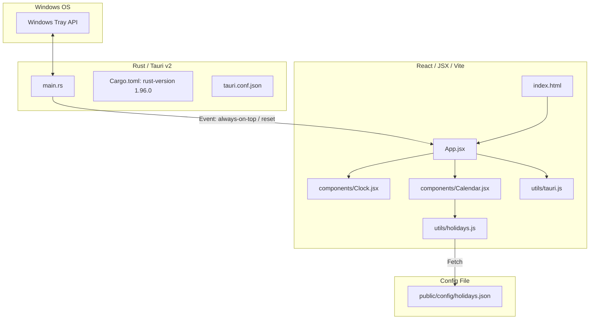

# Clondar Pro Developer Guide (Vite React Edition)

**English** | [日本語版](../ja/DEVELOPMENT.md)

This document is a developer-focused guide explaining the internal architecture, source code organization, system tray implementation, and external holidays definition file structures of Clondar Pro.

---

## 1. Architectural Overview

To deliver a desktop widget experience that remains operational even when the PC is completely offline, Clondar Pro utilizes a **local bundling build setup powered by Vite, React, and Tailwind CSS**.



### Technology Stack Choices
* **Vite / ESM**:
  Provides fast Hot Module Replacement (HMR) during local development and bundles all assets locally into the `ui/dist/` directory during compilation.
* **React & Tailwind CSS (v3)**:
  Enables component-driven UI design and utility-first styling utilizing packages stored entirely within local `node_modules`. This ensures the UI launches immediately without external web dependencies.
* **Tauri v2 JS API**:
  Integrates safe, typed OS calls (window state storage, pinning, termination, etc.) through the `@tauri-apps/api` JS packages.

---

## 2. Directory Layout

The frontend is housed inside the `ui/` directory and is modularized as follows:

```
ui/
├── index.html           # Entry HTML (Vite main)
├── vite.config.js       # Vite configurations (Target build: dist)
├── tailwind.config.js   # Tailwind CSS v3 configuration
├── postcss.config.js    # CSS processor config
├── package.json         # Frontend package dependencies
├── public/
│   └── config/
│       └── holidays.json # External holidays file (Copied to dist/config/ during builds)
└── src/
    ├── main.jsx         # React mount entry point
    ├── App.jsx          # Shell layout, state controls, tray event subscriptions
    ├── index.css        # Tailwind directives + custom styles
    ├── components/
    │   ├── Clock.jsx    # Digital & Analog clock renderings
    │   └── Calendar.jsx # Calendar grids, holiday indications, tooltips
    └── utils/
        ├── holidays.js  # Async holidays fetch and date calculations
        └── tauri.js     # Safe wrapper abstractions for Tauri v2 APIs
```

---

## 3. Setup & Development Server Launch

Building and running this application requires **Node.js (v26.4.0+ recommended)** and **Rust (1.96.0+ recommended)**.

It also utilizes the shared library `common_lib` as a build dependency.

### Resolving `common_lib` Dependencies
This project depends on the external shared library `common_lib`. To ensure GitHub Actions and Dependabot updates succeed, the dependency is configured as a direct Git reference in `src-tauri/Cargo.toml`:
```toml
common_lib = { git = "https://github.com/tkshnkgwr/common_lib" }
```

When modifying `common_lib` locally in parallel (`../../common_lib`), you can override this Git dependency with a local path using `src-tauri/.cargo/config.toml`.

Before starting development, create `src-tauri/.cargo/config.toml` (git-ignored) and add the following paths:
```toml
paths = ["../../common_lib"]
```


### 1. Install Dependencies
Run the following inside the project root:
```bash
# Install frontend packages
npm --prefix ui install
```

### 2. Launch in Development Mode
Vite development server configurations are integrated directly into Tauri. Run:
```bash
cargo tauri dev
```
Hot-reloading is triggered automatically for both Rust backend and React frontend changes.

### 3. Production Release Build
```bash
cargo tauri build
```
Vite compiles and packages frontend files into `ui/dist`, followed by Tauri creating native Windows MSI and EXE installers.

---

## 4. Technical Highlights

### ① System Tray Residence
The Rust backend [main.rs](file:///c:/Users/632792/Documents/自作/clondar/src-tauri/src/main.rs) uses `TrayIconBuilder` to configure a system tray icon.
Users can right-click the icon to control visibility, toggle Always on Top, reset coordinates, or terminate the application.
Always on Top toggles and coordinate resets instantly dispatch events through Tauri's event bus (`always-on-top-toggled`, `position-reset`) to sync frontend states.

### ② External Holiday Configuration (`holidays.json`)
Calculations for Japanese national holidays are configured inside `ui/public/config/holidays.json`.
[holidays.js](file:///c:/Users/632792/Documents/自作/clondar/ui/src/utils/holidays.js) fetches this dynamically during boot, applying calculations for fixed dates, Happy Mondays, Emperors' birthdays, and Olympic special schedule modifications. Adjusting dates inside the JSON updates the calendar without modifying React application code.

---

## 5. Coding & Documentation Standards

To maintain code readability and maintainability, the project implements the following documentation guidelines:

### ① Creating & Synchronizing Document Comments (RustDoc / JSDoc)
When writing new code or modifying existing interfaces, update document comments (RustDoc / JSDoc):
* **Rust**: Document crates, modules, structs, enums, functions, and methods using `///` or `//!` comments.
* **JavaScript / React**: Document components, hooks, and helpers using `/** ... */` comments. Define `@param` and `@returns` explicitly.

### ② Inline Comment Language
All code comments and documentation tags must be written in **Japanese**. Translate any leftover English comments to Japanese during development updates.
