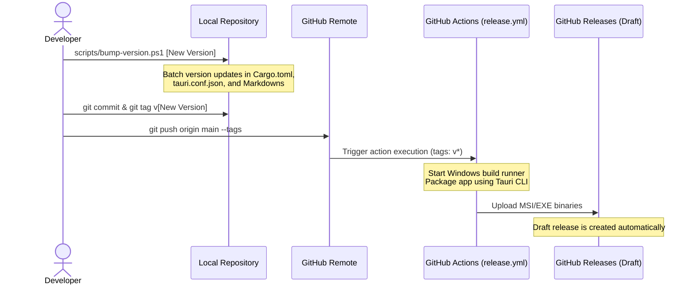

# Clondar Pro Release Procedure (GitHub Actions Automation)

**English** | [日本語版](../ja/RELEASE.md)

This document is a guideline explaining how to update versions, build release packages, and manage the automated release pipeline via GitHub Actions for Clondar Pro.

---

## 1. Release Pipeline Overview

Releases of Clondar Pro are managed through a **GitHub Actions automated compilation workflow** triggered by pushing a local version tag (`v*`).



---

## 2. Preparing Releases Locally

Before packaging a release, all project-wide version designations (`Cargo.toml`, `tauri.conf.json`, technical Markdown files) must be incremented. A PowerShell script is provided to automate this batch update.

### 2.1 Running the Batch Version Update Script

Launch PowerShell and execute the version bump script in the root directory:

```powershell
# Temporarily bypass script execution policy (e.g., updating version to 1.3.1)
powershell -ExecutionPolicy Bypass -File .\scripts\bump-version.ps1 1.3.1
```

- **Script Behavior**:
  - Updates `version = "..."` inside `src-tauri/Cargo.toml`.
  - Updates `version` mappings (including Windows internal versions) inside `src-tauri/tauri.conf.json`.
  - Updates the matching version field in `docs/ja/TEST_REPORT.md`.
  - Runs `git add` to stage updated files automatically.

---

## 3. Creating & Pushing Version Tags

Once files are updated, commit the changes, tag the commit with the target version number, and push them to the GitHub repository:

```bash
# 1. Commit update changes
git commit -m "chore: release version 1.3.1"

# 2. Tag target commit (following semantic version naming conventions, prefixed with 'v')
git tag v1.3.1

# 3. Push commit and tagging attributes to the remote origin
git push origin main
git push origin v1.3.1
```

---

## 4. Automated Build & Draft Release via GitHub Actions

Once GitHub detects a tagged push, `.github/workflows/release.yml` triggers automatically.

### 4.1 Actions Workflow Processes
1. **Environment Setup**: Provisions Node.js and Rust (MSVC targets) runners.
2. **Git Authentication Setup**: Installs access tokens to fetch the private shared crate `common_lib` securely.
3. **Frontend Asset Compilation**: Runs `npm ci` inside the `ui/` directory and compiles assets via Vite.
4. **Tauri App Compilation**: Runs `tauri build` to package native Windows executable binaries.
5. **Releases Draft Generation**: Uses `softprops/action-gh-release@v2` to draft a GitHub Release and attach the compiled installation binaries.

### 4.2 Compiled Release Assets
Upon successful compilation, the following binaries are uploaded to the GitHub Release:
- `clondar/src-tauri/target/release/bundle/nsis/*.exe` (NSIS silent executable installer)
- `clondar/src-tauri/target/release/bundle/wix/*.msi` (WiX installer package)

---

## 5. Publishing Releases

1. Open the repository on GitHub and navigate to "**Releases**".
2. Confirm the draft release for version `v1.3.1` exists.
3. Edit the release description notes (e.g., copying notes from the CHANGELOG) and click "**Publish release**".
