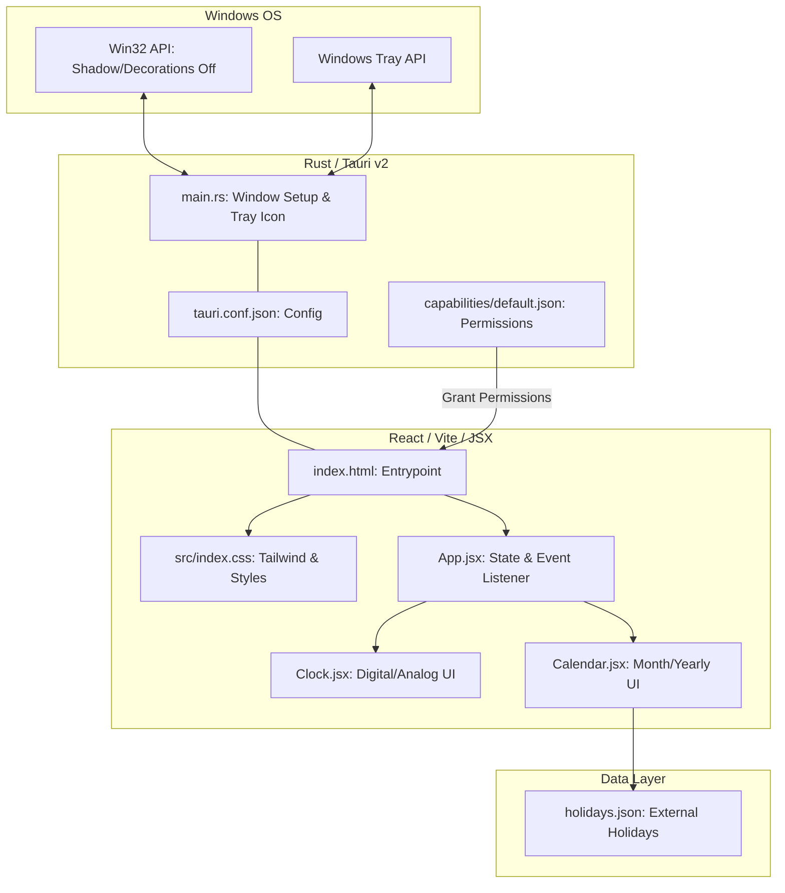

# Clondar Pro Product Specification (Tauri v2 Edition)

**English** | [日本語版](../ja/SPECIFICATION.md)

## 1. Product Overview
**Clondar Pro** is a Tauri v2-powered desktop widget application featuring an integrated clock & calendar designed specifically for Windows.
Embodying the concept of "wallpaper integration", it strives for ultimate visual minimalism by removing standard window decorations, borders, and drop shadows on transparent backgrounds.

---

## 2. System Architecture Diagram (Mermaid)

### 2.1 Component Architecture

---

## 3. Core Features Detail

### 3.1 Widget Behavior (Desktop Widget)
* **Window Transparency**: Background is rendered 100% transparently, projecting elements directly onto the desktop wallpaper.
* **Borderless & Shadowless**: Physical OS-native title bars, window borders, and drop shadows are completely removed.
* **Always on Top**: Keeps the widget anchored above other application windows for quick referencing.
* **Drag-to-Move**: Map the entire widget canvas to a draggable region (`data-tauri-drag-region`), allowing users to reposition the widget freely.
* **Exit Operation**: Exit the application instantly by pressing the `Esc` key or clicking the `❌` button in the UI.
* **System Tray Resident Menu**:
  - Resides inside the system tray to retain controls if the window is hidden or lost off-screen.
  - Right-click context menus allow users to toggle visibility, toggle Always on Top, reset coordinates to the screen center, or exit the application.

### 3.2 Clock Section
* **Digital Clock**:
  - **Font**: Utilizes a bold, muscular sans-serif design inspired by `Impact`.
  - **Stability**: Monospaced tabular numbering configurations prevent elements shifting during updates.
  - **Formats**: Toggle between 12-hour and 24-hour style guides, and show/hide the seconds indicator.
* **Analog Clock**:
  - Smooth sweep-second hand rotation.
  - Minimal visual styling matching dark themes.

### 3.3 Calendar Section
* **Visual Stability**: Maintains a locked **6-week (42-day)** grid layout regardless of the length of the month.
* **External Holiday Loading & Saving (Persistence)**:
  - Fetches configuration files from user local directories (`%LOCALAPPDATA%/com.clondar.pro/holidays.json`) during boot (routed through Tauri IPC command `load_holidays_json`).
  - If files are missing, the backend generates a default template automatically (falls back to traditional AJAX `fetch` in web browsers).
  - Dynamically calculates dates for fixed public holidays, Happy Mondays, Emperors' birthdays, astronomical dates (Equinoxes), and custom overrides (e.g., Olympic shifts).
  - Adjust definitions or custom items directly from the visual interface.
* **Yearly Overlay**: Full-screen yearly calendar viewer with previous/next year navigation controls.
* **Holidays Manager**:
  - Connects to the shared Rust library `common_lib`.
  - **Visual Editing**: Edit fixed holidays (add dates/names or delete entries in one click) in the UI. Click "Save and Apply" to write coordinates to file using `save_holidays_json` and reload calendar grids.
  - **Line-by-Line Diffs**: Compares active configuration changes with built-in fallbacks. Uses `common_lib::compute_diff` (LCS algorithm) on the backend to render additions (green) and deletions (red) visually.
  - **Definitions Statistics**: Scans configuration files using `common_lib::count_occurrences` to compile instances matching labels (such as "Day", "Birthday", "Substitute Holiday", "National Press Holiday") in a tabular grid.

### 3.4 State Persistence
* **Preference Memory**: Preserves preferences inside `localStorage` to restore configurations on relaunch:
  - 12H/24H formats
  - Seconds visibility
  - Clock selection (Digital / Analog)
  - Dark Mode status
  - Transparent backgrounds
  - Always on Top status
* **Window Coordinate Persistence**:
  - Captures and records physical absolute coordinates (`PhysicalPosition`) at exit, restoring coordinates at relaunch using Tauri v2 `setPosition` APIs.
  - **Startup Race Guard**: Locks coordinate saves for 1 second during boot using `isRestoringRef` to prevent centering routines or scale updates from overwriting clean position states.
  - **Tray Coordinate Synchronization**: Updates memory coordinates immediately when resetting positions from the system tray menu.

---

## 4. Visual Styles & UI/UX Specifications

### 4.1 Visual Design
* **Glassmorphism**: Soft background-blur filters maintain layout readability against desktop wallpapers.
* **Borderless Look**: Employs no physical borders. In Always on Top mode, a soft blue outline (Ring) surrounds the widget.
* **Typography**: Paired combination of `Inter` for UI layouts and `JetBrains Mono` for clock/calendar numbers.

### 4.2 User Interaction
* **Blocked Context Menus**: Disables standard browser right-click menus to preserve widget integrity (the system tray shows customized menus instead).
* **Hover Details**: Displays holiday labels inside standard tooltips.

---

## 5. Technology Stack
* **Backend**: Rust (Tauri v2) integrated with the shared crate `common_lib`.
* **Frontend**: React 18 (Vite), Tailwind CSS (v3)
* **Architecture**: Local Bundled SPA (Offline Complete)
* **Animation**: Framer Motion
* **Permissions**: Tauri v2 Capabilities System
* **CI/CD**: GitHub Actions (Automated Release Builds), Dependabot (Weekly dependency checking)

---

## 6. Notable Implementation Details
1. **Local Bundled SPA (Offline Complete)**:
   Bundles all packages using Vite. Ensures the application operates flawlessly without requiring internet connectivity or CDN asset loads.
2. **System Tray Integration**:
   Bridges Rust tray events and React states using Tauri's IPC event buses (`emit` / `listen`) to sync coordinates and toggle Always on Top status.
3. **Shadow Removal**: Combines backend WinAPI configurations `set_shadow(false)` with Tauri config settings `shadow: false` to remove transparent window borders completely.
4. **DPI-Aware Coordinate Restoration**: Stores physical pixels (`type: pos.type || 'Physical'`) instead of scaled logical points to ensure accurate window placement in mixed multi-monitor setups.
5. **Shared Crate Integration (common_lib)**:
   Imports text matching and LCS processing algorithms from `common_lib` to power Tauri command systems (`get_holidays_diff`, `get_word_count`), avoiding code duplication.

## 7. Package Compilation Specifications
* **NSIS (EXE Installer)**:
  - Multi-language installer support for English and Japanese.
  - Prompts language selections during execution, parsing system locales automatically.
* **WiX (MSI Installer)**:
  - Parallel compilation workflow generating distinct packages for Japanese (`ja-JP`) and English (`en-US`).

---
**Last Updated**: July 14, 2026
**Version**: 1.3.7
**Internal Version**: 1.3.7.0
